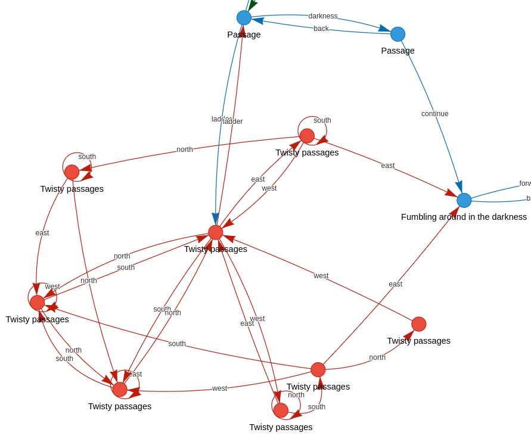
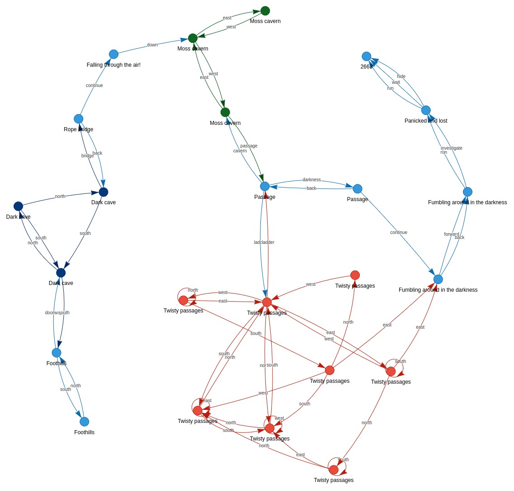
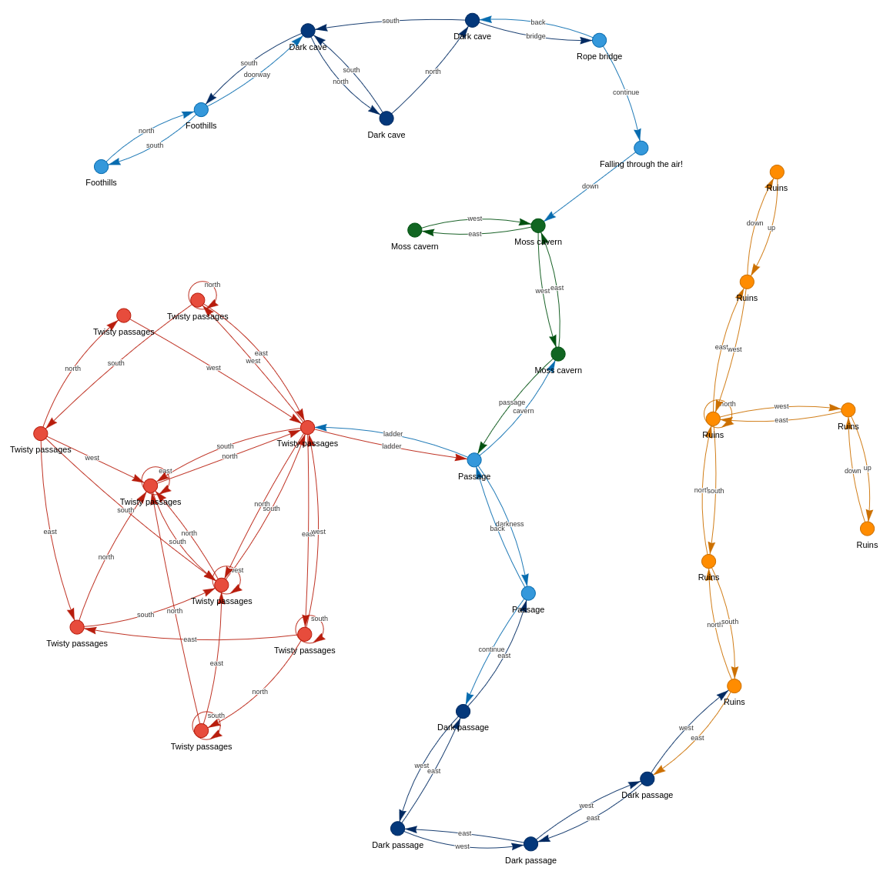
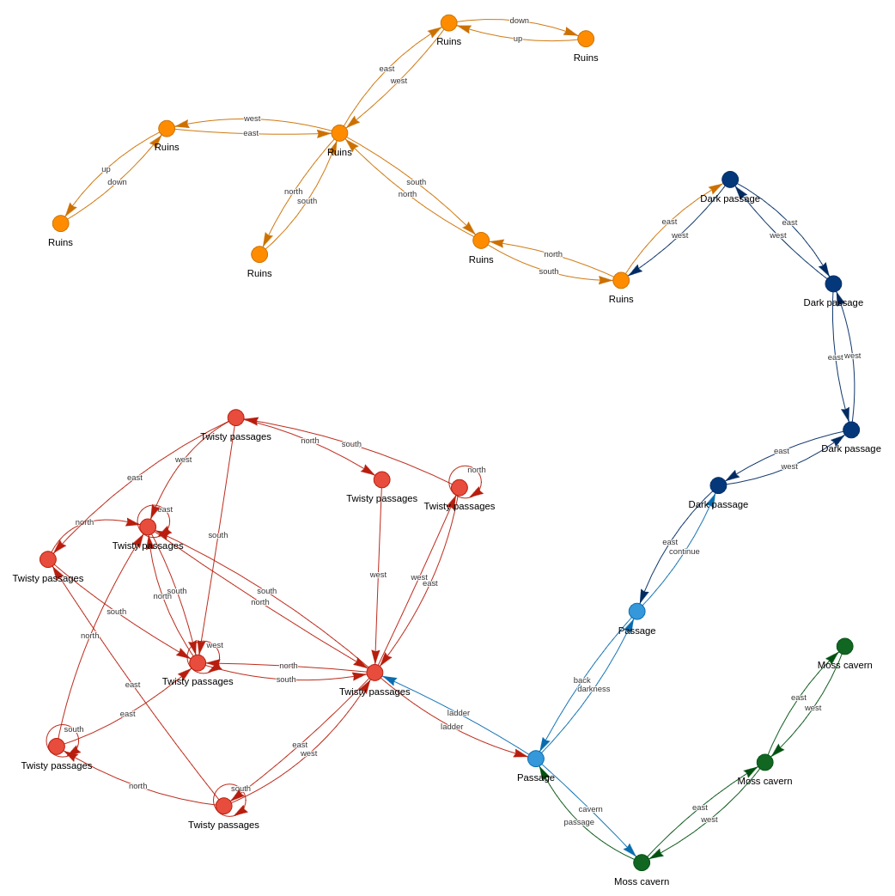
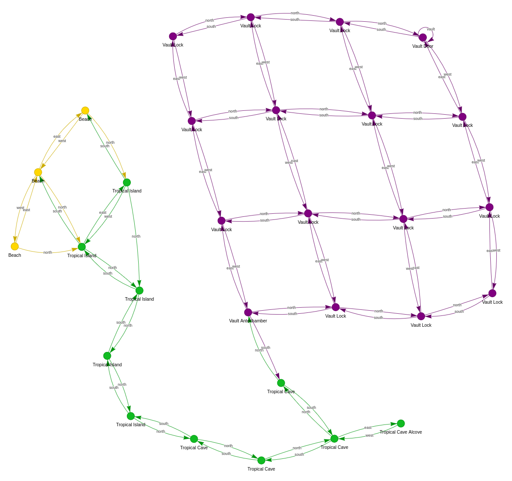
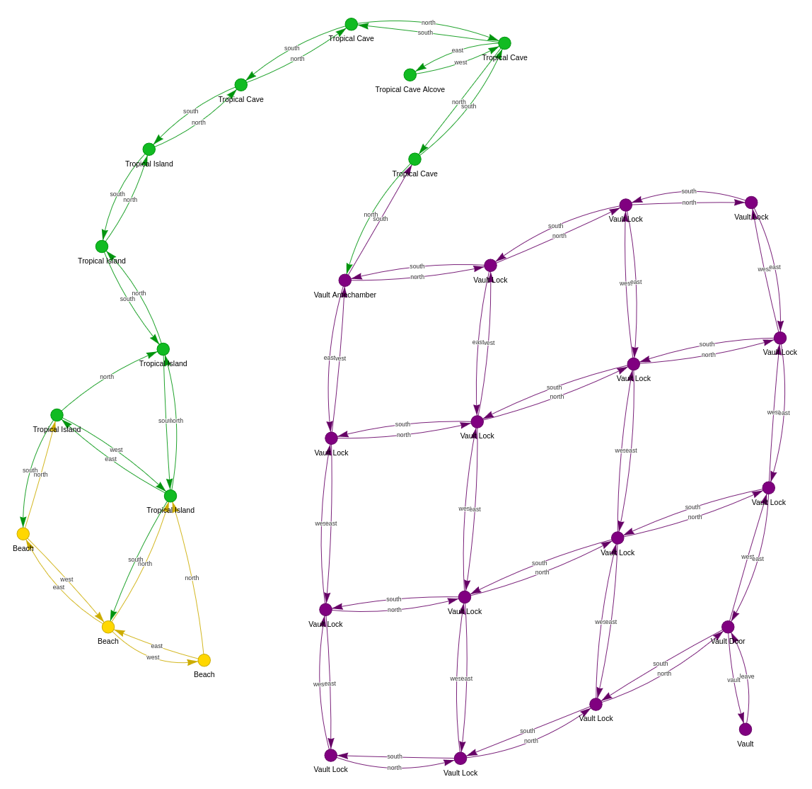

# Synacor Challenge Solution

This repository contains my solution (and related files) for the [Synacor Challenge](https://github.com/xunoaib/synacor-challenge)

---

## ⚠️ Warning! Spoilers Ahead! ⚠️

## Consider looking away if you have not already completed this challenge!

## Synacor can only be completed once and is easily spoilable!

---

# Table of Contents

- [Files](#files)
- [Objective](#objective)
- [Codes](#codes)
  - [Code 1: Architecture Spec](#code-1-architecture-spec)
  - [Code 2: Pre-Self-Test Code](#code-2-pre-self-test-code)
  - [Code 3: Post-Self-Test Code](#code-3-post-self-test-code)
  - [Code 4: Tablet](#code-4-tablet)
  - [Code 5: Twisty Maze](#code-5-twisty-maze)
  - [Code 6: Coins Puzzle](#code-6-coins-puzzle)
  - [Code 7: Teleporter](#code-7-teleporter)
    - [Disassembling the Teleporter Call](#disassembling-the-teleporter-call)
    - [Analyzing the Teleporter Call Site](#analyzing-the-teleporter-call-site)
    - [Analyzing the Teleporter Call](#analyzing-the-teleporter-call)
    - [Optimizing the Teleporter Call](#optimizing-the-teleporter-call)
      - [Algorithm Analysis](#algorithm-analysis)
    - [Patching the Teleporter Call](#patching-the-teleporter-call)
  - [Code 8: Vault Puzzle](#code-8-vault-puzzle)
- [Extras](#extras)
  - [Debug Commands](#debug-commands)
  - [Self-Test Decryption](#self-test-decryption)
  - [Memory Hacking](#memory-hacking)
  - [Map Visualizations](#map-visualizations)

---

# Files

Core:
- [basevm.py](basevm.py) -- Base emulator implementing core VM functionality.
- [vm.py](vm.py) -- Enhanced emulator with extra features / debug commands.
- [run.py](run.py) -- Launches an interactive VM from a binary.

Solvers:
- [solve_all.py](solve_all.py) -- Executes an end-to-end solution for a given binary, printing all codes found.
- [solve_coins.py](solve_coins.py) -- Solves the ruins coin puzzle.
- [solve_teleporter_pure_memo.c](solve_teleporter_pure_memo.c) -- Solves the teleporter puzzle with pure memoization, no other optimizations (C).
- [solve_teleporter.py](solve_teleporter.py) -- Solves the teleporter puzzle after simplification (Python).
- [solve_teleporter.c](solve_teleporter.c) -- Solves the teleporter puzzlle after simplification (C).
- [solve_vault.py](solve_vault.py) -- Solves the vault puzzle.

Extras:
- [disassembler.py](disassembler.py) -- Disassembles a binary
- [plot_maps.py](plot_maps.py) -- Renders graph-based HTML/PNG visualizations of the game world (called by solve_all.py)
- [maps/](maps) -- Contains rendered HTML/PNG maps (HTML best viewed in a browser)

# Objective

The challenge contains eight unique codes, each found by completing the following puzzles:

- **Code 1:** Found in `arch-spec`
- **Code 2:** VM pre-self-test
- **Code 3:** VM post-self-test
- **Code 4:** Tablet
- **Code 5:** Twisty Maze
- **Code 6:** [Coins](solve_coins.py)
- **Code 7:** Teleporter ([Python](solve_teleporter.py) / [C](solve_teleporter.c))
- **Code 8:** [Vault](solve_vault.py)

# Codes

## Code 1: Architecture Spec

The first code is found in the hints section of the VM architecture spec
(`arch-spec`). Amusingly, this was the last code I found.

## Code 2: Pre-Self-Test Code

Running the binary after implementing the `out` and `noop` instructions reveals
the pre-self-test code.

## Code 3: Post-Self-Test Code

Implementing the remaining VM instructions will allow the self-test to
complete, revealing the next code.

Now that all instructions have been implemented, it seems we've been dropped
into a text-adventure game!

## Code 4: Tablet

Once the self-test completes, immediately type `take tablet` and `use tablet`
to receive the next code.

Note: For later puzzles, be sure to also collect the `empty lantern` from the
easternmost moss cavern.

## Code 5: Twisty Maze

Explore the area to reveal a ladder leading to twisty passages. The maze seems
unpredictable, with different exits leading to unexpected locations. However,
the maze is quite deterministic and can be easily mapped out by recording your
current location, moving in a direction, and then recording your new location.
Each location has a similar but slightly different description which can be
used to uniquely identify it.

You'll eventually discover a passage with a code chiseled on the wall (and a
can of oil, which you should `take`). Interestingly, this code will only be
correct if you have arrived at the location using in-game commands (no
cheating). Using location hacks (i.e. by modifying memory) will cause an
invalid code to appear.

Below is a visualization of the maze. The rightmost red node has the code and
can of oil.



Once you have the `can` and `empty lantern`, refuel and light your lantern
(`use can` and `use lantern`). You can now safely navigate the dark passage to
the ruins.

## Code 6: Coins Puzzle

Entering the central hall reveals a puzzle with circular slots and symbols:

    _ + _ * _^2 + _^3 - _ = 399

It seems we must enter some values here which satisfy the equation.

We can explore the ruins to collect five coins, each of which represents a
different value when inspected:

- red coin: 2 dots
- corroded coin: triangle (3 points)
- shiny coin: pentagon (5 points)
- concave coin: 7 dots
- blue coin: 9 dots

The correct solution can be found with [bruteforce, z3](solve_coins.py), or
sheer mental reasoning:

    9 + 2 * 5^2 + 7^3 - 3 = 399

Return to the central hall and insert the coins corresponding to each value in
left-to-right order:

```
use blue coin
use red coin
use shiny coin
use concave coin
use corroded coin
```

The north door emits a click as it unlocks. Go north, take the teleporter, and
use it. As you spiral through time and space, the next code appears in the
stars!

## Code 7: Teleporter

The teleporter brings you to Synacor Headquarters, which appears to be a really
fun place to work. The strange book here also reveals some hidden behavior of
the teleporter:

<details>
    <summary>look strange book</summary>

```
The cover of this book subtly swirls with colors.  It is titled "A Brief Introduction to Interdimensional Physics".  It reads:

Recent advances in interdimensional physics have produced fascinating
predictions about the fundamentals of our universe!  For example,
interdimensional physics seems to predict that the universe is, at its root, a
purely mathematical construct, and that all events are caused by the
interactions between eight pockets of energy called "registers".
Furthermore, it seems that while the lower registers primarily control mundane
things like sound and light, the highest register (the so-called "eighth
register") is used to control interdimensional events such as teleportation.

A hypothetical such teleportation device would need to have have exactly two
destinations.  One destination would be used when the eighth register is at its
minimum energy level - this would be the default operation assuming the user
has no way to control the eighth register.  In this situation, the teleporter
should send the user to a preconfigured safe location as a default.

The second destination, however, is predicted to require a very specific
energy level in the eighth register.  The teleporter must take great care to
confirm that this energy level is exactly correct before teleporting its user!
If it is even slightly off, the user would (probably) arrive at the correct
location, but would briefly experience anomalies in the fabric of reality
itself - this is, of course, not recommended.  Any teleporter would need to test
the energy level in the eighth register and abort teleportation if it is not
exactly correct.

This required precision implies that the confirmation mechanism would be very
computationally expensive.  While this would likely not be an issue for large-
scale teleporters, a hypothetical hand-held teleporter would take billions of
years to compute the result and confirm that the eighth register is correct.

If you find yourself trapped in an alternate dimension with nothing but a
hand-held teleporter, you will need to extract the confirmation algorithm,
reimplement it on more powerful hardware, and optimize it.  This should, at the
very least, allow you to determine the value of the eighth register which would
have been accepted by the teleporter's confirmation mechanism.

Then, set the eighth register to this value, activate the teleporter, and
bypass the confirmation mechanism.  If the eighth register is set correctly, no
anomalies should be experienced, but beware - if it is set incorrectly, the
now-bypassed confirmation mechanism will not protect you!

Of course, since teleportation is impossible, this is all totally ridiculous.
```
</details>

This tells us that we must write a specific value to the eighth register before
using the teleporter again, and that we may also need to optimize the
underlying code somehow.

For now, we can assign an arbitrary value to the eighth register and use the
teleporter to see what happens. For this purpose, I created a custom `.wr <reg>
<value>` command in my VM:

```
> .wr 7 1234
> use teleporter

A strange, electronic voice is projected into your mind:

  "Unusual setting detected!  Starting confirmation process!  Estimated time to completion: 1 billion years."
```

This causes the VM to hang indefinitely, and my CPU fan indicates that it's
doing some heavy work.

To see what our VM is doing, we can print the address and disassembly of each
instruction as it's being executed. Inspecting the output, we notice an
excessive number of repeating calls to a function at address 6027 (the `call
6027` instruction). Here's a live log of the instructions being executed,
starting right before the first call to this function. For clarity, each call
to 6027 is marked with a 👈.

**Live Instruction Trace:**
```
<addr> <instruction>
...
5478 noop 
5479 noop 
5480 noop 
5481 noop 
5482 noop 
5483 set r0 4
5486 set r1 1
5489 call 6027 👈 (first call)
6027 jt r0 6035
6035 jt r1 6048
6048 push r0
6050 add r1 r1 32767
6054 call 6027 👈
6027 jt r0 6035
6035 jt r1 6048
6038 add r0 r0 32767
6042 set r1 r7
6045 call 6027 👈
6027 jt r0 6035
6035 jt r1 6048
6048 push r0
6050 add r1 r1 32767
6054 call 6027 👈
6027 jt r0 6035
6035 jt r1 6048
6048 push r0
6050 add r1 r1 32767
6054 call 6027 👈
6027 jt r0 6035
6035 jt r1 6048
6048 push r0
6050 add r1 r1 32767
6054 call 6027 👈
...
```

### Disassembling the Teleporter Call

Given the lack of `ret` instructions after each `call 6027`, we can deduce that
this function is recursive. In this case, instead of a live disassembly, it may
be more helpful to analyze a static disassembly of this function (at address
6027) and the region where it is first called (address 5489):

**Disassembled Call Site (as it appears in memory)**:
```
5478  noop
5479  noop
5480  noop
5481  noop
5482  noop
5483  set r0 4
5486  set r1 1
5489  call 6027 👈 (first call)
5491  eq r1 r0 6
5495  jf r1 5579
5498  push r0
5500  push r1
5502  push r2
5504  set r0 29014
5507  set r1 1531
5510  add r2 1816 12241
5514  call 1458
```

**Disassembled Function (6027) (as it appears in memory)**:
```
6027  jt r0 6035 👈 (entrypoint of function)
6030  add r0 r1 1
6034  ret
6035  jt r1 6048
6038  add r0 r0 32767
6042  set r1 r7
6045  call 6027 👈
6047  ret
6048  push r0
6050  add r1 r1 32767
6054  call 6027 👈
6056  set r1 r0
6059  pop r0
6061  add r0 r0 32767
6065  call 6027 👈
6067  ret
```

### Analyzing the Teleporter Call Site

Analyzing the initial call site, we have:

```
5483  set r0 4
5486  set r1 1
5489  call 6027  👈 <- function call
5491  eq r1 r0 6    <- check if r0 == 6
5495  jf r1 5579    <- if above check is false (r0 != 6), jump to 5579
5498  push r0       <- otherwise, continue here (r0 == 6)
5500  push r1
5502  push r2
5504  set r0 29014
5507  set r1 1531
5510  add r2 1816 12241
5514  call 1458
```

Before the first call to this function, we see that the value 0 is written to
register 4, and 1 is written to register 1.

The function is then called, and once it returns, the VM checks if register 0
contains a value of 6, jumping to address 5579 if false (`r0 != 6`), or
continuing to address 5498 if true (`r0 == 6`).

Judging from this code, the output of the function is likely stored in `r0`, and
its value is likely expected to be 6 given the observed inputs (`r0 = 4`, `r1 = 1`,
and `r7 = ?`). However, the correct input value for the eighth register (`r7`) is
still unknown.

Our goal appears to be twofold:
1. to find the correct value of `r7` which causes the initial function call to
   return 6 (stored in `r0`).
2. to ensure this function call completes in a reasonable time, before the heat
   death of the universe.

### Analyzing the Teleporter Call

To simplify our analysis, we can rewrite the recursive 6027 function in Python:

```python
# we can treat R7 (the eighth register) as a global constant,
# since the function never modifies it.

def call_6027(r0, r1):
    if r0 == 0:
        return (r1 + 1) % 32768

    if r1 == 0:
        return call_6027(r0 - 1, R7)

    new_r0 = r0 - 1
    new_r1 = call_6027(r0, r1 - 1)
    return call_6027(new_r0, new_r1)
```

Educated readers might recognize this as the [Ackermann
Function](https://en.wikipedia.org/wiki/Ackermann_function), though I did not!

---
I found it difficult to meaningfully characterize this function in plain language,
but here's my attempt:

- The function accepts two input parameters: `r0` and `r1`.
- The function has one base case when `r0 == 0`, returning `r1 + 1`.
- When `r1 == 0`, it starts a recursive call, subtracting one from `r0` and assigning `R7` (the unknown value in the eighth register) to `r1`.
- Otherwise, two more recursive calls are performed:
    - In one call, `r0` is passed along as-is (becoming the `new_r0`), while `r1` is
    decremented by 1. The result of this recursive call becomes the `new_r1`.
    - Then, the function is called again with the `new_r0` and `new_r1`, and the result
    is returned.
---

We now begin to appreciate the time complexity of this function.

- When `r0` is zero, we return `r1 + 1`
- When `r1` is zero, we return the result of the call where `r0` is decremented
by one and `r1` is assigned to `R7` (the eighth register).
- When `r0` and `r1` are both nonzero, we return the result of the call where
`r0` is decremented by one, and where `r1` is assigned to the result of the
call where `r0` is unchanged and `r1` is decremented by one.

This has an extremely high time complexity, as `r0` and `r1` are progressively
decremented to zero and then reset to very large values, with many deep and
redundant recursive branches. I have yet to formally compute the time
complexity of this function, but we know we have to optimize it!

### Optimizing the Teleporter Call

To speed up computation of this function, we can apply
[memoization](https://en.wikipedia.org/wiki/Memoization). This approach
dramatically improves performance by caching the results of many potentially
expensive and redundant function calls. Now equipped with a more efficient way
to execute this function, bruteforcing all values for r7 between 0 and 32768
becomes much more feasible (searching for one which returns 6, our expected
output). In a suitable programming language (such as C), memoization
trivializes this calculation, requiring minimal modifications to the function
(see [solve_teleporter_pure_memo.c](solve_teleporter_pure_memo.c)).

Unfortunately, Python is not one of these languages (with the equivalent
implementation still exceeding my increased recursion limit, even with
memoization), so further optimization is required for this to work in Python.

#### Algorithm Analysis

Python's poor performance here is somewhat of a blessing in disguise. It gives
us an opportunity to analyze and appreciate the algorithm on a deeper level 🙂.

We can begin to untangle the recurrence with a bit of substitution. Here are my
original notes.

By applying incremental substitutions to simpler, more "fundamental" instances
of the recurrence, we can begin to construct some rules which will allow us to
rewrite more complex calls in simpler terms. This work is shown below:

General Rules and Base Case(s):

    f(0, B) = B + 1
    f(A, 0) = f(A-1, R7)
    f(A, B) = f(A-1, f(A, B-1))

Simplifying `f(1, B)`:

    f(1, B) = f(0, f(1,B-1)) <- apply f(0,B) substitution
            = f(1, B-1) + 1
            = f(0, f(1,B-2)) + 1 <- apply f(0,B) substitution
            = f(1, B-2) + 2
            = f(0, f(1,B-3)) + 2 <- apply f(0,B) substitution
            = f(1, B-3) + 3
            = ...
            = f(1, B-B) + B
            = f(1, 0) + B
            = f(0, R7) + B
            = R7 + 1 + B

    f(1, B) = R7 + 1 + B 👈

Simplifying `f(2, B)`:

    f(2, B) = f(1, f(2, B-1)) <- apply f(1,B) substitution
            = R7 + 1 + f(2, B-1)
            = R7 + 1 + f(1, f(2, B-2)) <- apply f(1,B) substitution
            = 2*(R7 + 1) + f(2, B-2)
            = 2*(R7 + 1) + f(1, f(2, B-3)) <- apply f(1,B) substitution
            = 3*(R7 + 1) + f(2, B-3)
            = ...
            = B*(R7 + 1) + f(2, B-B)
            = B*(R7 + 1) + f(2, 0)
            = B*(R7 + 1) + f(1, R7) <- apply f(1,B) substitution
            = B*(R7 + 1) + R7 + 1 + R7
            = B*(R7 + 1) + 2*R7 + 1

    f(2, B) = B*(R7 + 1) + 2*R7 + 1 👈

Attempting to Simplify `f(3, B)`:

    f(3, B) = f(2, f(3, B-1)) <- apply f(2,B) substitution
            = f(3, B-1) + 2*R7 + 1
            = f(2, f(3, B-2)) + 2*R7 + 1 <- apply f(2,B) substitution
            = [f(3,B-2) * (R7+1)+1] + 2*R7 + 1
            = f(3,B-2) * (R7+1) + 2*R7 + 2
            = f(2, f(3,B-3)) * (R7+1) + 2*R7 + 2
            = [f(3,B-3) * (R7+1) + 2*R7 + 1] * (R7+1) + 2*R7 + 2
            = f(3,B-3) * (R7+1)^2 + 2*R7*(R7+1) + R7+1 + 2*R7 + 2
            = f(3,B-3) * (R7+1)^2 + 2*R7*(R7+1) + 3*R7 + 3
            = ... (gets messy)

The `f(3, B)` call continues to expand with increasingly complex terms, and can
probably be written more generally, but I decided to stop here.

While `f(3, B) = f(2, f(3, B-1))` isn't so easily simplified, we notice that
`f(3, B)` depends on `f(3, B-1)`, and so on, until `f(3, 0)`.

Therefore, at worst, the maximum recursive depth here is B (32768 levels), with
a branching factor of 1 (no real branching). This means that `f(3, B)` is
relatively easy to compute for a given value of R7 (or even all values of R7!).

Now, working backwards from the known inputs and expected output:

    f(4, 1) = 6
    f(4, 1) = f(3, f(4, 0))
            = f(3, f(3, R7))

Thus, we're looking for a value of R7 which satisfies the above expression. For
all values of R7, we can compute `f(3, f(3, R7))` and stop when this call
returns the expected output of 6.

See [solve_teleporter.py](solve_teleporter.py) and
[solve_teleporter.c](solve_teleporter.c) for solution code which computes the
correct value of the eighth register after the above simplifications.

See [solve_teleporter_pure_memo.c](solve_teleporter_pure_memo.c) for my
original solution using naive memoization.

After all this work, we discover that the secret value of `r7` must be **25734**! ⭐

### Patching the Teleporter Call

We now know the correct input value for `r7`, but simply writing this value to
`r7` is not enough. The function is still extremely slow; We need to skip the
expensive call. Fortunately, now that we know the expected inputs and outputs
of this function, there is no need to actually execute it. Instead, we can add
VM logic to skip the `call 6027` instruction when it is encountered, and write
the expected post-call values into the appropriate registers (`r0`, `r1` and
`r7`). This allows us to replicate the behavior of the function without
actually executing it.

After patching the call, we can set `r7` to the secret value 25734, then use
the teleporter again, which brings us to a new location: the beach!

```
> .wr 7 25734
> use teleporter

A strange, electronic voice is projected into your mind:

"Unusual setting detected!  Starting confirmation process!  Estimated time to
completion: 1 billion years."

You wake up on a sandy beach with a slight headache.  The last thing you
remember is activating that teleporter... but now you can't find it anywhere in
your pack.  Someone seems to have drawn a message in the sand here:

<<< code_#7 >>>

It begins to rain.  The message washes away.  You take a deep breath and feel
firmly grounded in reality as the effects of the teleportation wear off.

== Beach == This is a sandy beach in a cove on some tropical island.  It is
raining.  The ocean is to your south, and heavy foliage is to your north; the
beach extends west and east.

There are 3 exits:
- west
- east
- north

What do you do?
```

## Code 8: Vault Puzzle

A path leads from the beach into the tropical island, a tropical cave, and then finally the vault. A journal can also be found in a tropical cave alcove along the way, containing hints for the vault puzzle:

<details>
    <summary>look journal</summary>

```
> look journal


Fireflies were using this dusty old journal as a resting spot until you scared
them off.  It reads:

Day 1: We have reached what seems to be the final in a series of puzzles
guarding an ancient treasure.  I suspect most adventurers give up long before
this point, but we're so close!  We must press on!

Day 1: P.S.: It's a good thing the island is tropical.  We should have food for
weeks!

Day 2: The vault appears to be sealed by a mysterious force - the door won't
budge an inch.  We don't have the resources to blow it open, and I wouldn't
risk damaging the contents even if we did.  We'll have to figure out the lock
mechanism.

Day 3: The door to the vault has a number carved into it.  Each room leading up
to the vault has more numbers or symbols embedded in mosaics in the floors.  We
even found a strange glass orb in the antechamber on a pedestal itself labeled
with a number.  What could they mean?

Day 5: We finally built up the courage to touch the strange orb in the
antechamber.  It flashes colors as we carry it from room to room, and sometimes
the symbols in the rooms flash colors as well.  It simply evaporates if we try
to leave with it, but another appears on the pedestal in the antechamber
shortly thereafter.  It also seems to do this even when we return with it to
the antechamber from the other rooms.

Day 8: When the orb is carried to the vault door, the numbers on the door flash
black, and then the orb evaporates.  Did we do something wrong?  Doesn't the
door like us?  We also found a small hourglass near the door, endlessly
running.  Is it waiting for something?

Day 13: Some of my crew swear the orb actually gets heaver or lighter as they
walk around with it.  Is that even possible?  They say that if they walk
through certain rooms repeatedly, they feel it getting lighter and lighter, but
it eventually just evaporates and a new one appears as usual.

Day 21: Now I can feel the orb changing weight as I walk around.  It depends on
the area - the change is very subtle in some places, but certainly more
noticeable in others, especially when I walk into a room with a larger number
or out of a room marked '*'.  Perhaps we can actually control the weight of
this mysterious orb?

Day 34: One of the crewmembers was wandering the rooms today and claimed that
the numbers on the door flashed white as he approached!  He said the door still
didn't open, but he noticed that the hourglass had run out and flashed black.
When we went to check on it, it was still running like it always does.  Perhaps
he is going mad?  If not, which do we need to appease: the door or the
hourglass?  Both?

Day 55: The fireflies are getting suspicious.  One of them looked at me funny
today and then flew off.  I think I saw another one blinking a little faster
than usual.  Or was it a little slower?  We are getting better at controlling
the weight of the orb, and we think that's what the numbers are all about.  The
orb starts at the weight labeled on the pedestal, and goes down as we leave a
room marked '-', up as we leave a room marked '+', and up even more as we leave
a room marked '*'.  Entering rooms with larger numbers has a greater effect.

Day 89: Every once in a great while, one of the crewmembers has the same story:
that the door flashes white, the hourglass had already run out, it flashes
black, and the orb evaporates.  Are we too slow?  We can't seem to find a way
to make the orb's weight match what the door wants before the hourglass runs
out.  If only we could find a shorter route through the rooms...

Day 144: We are abandoning the mission.  None of us can work out the solution
to the puzzle.  I will leave this journal here to help future adventurers,
though I am not sure what help it will give.  Good luck!

What do you do?
```
</details>

We enter the vault antechamber through a southwest corner (lower left), which
contains a pedestal on which '22' is carved and on which rests a mysterious orb
(which can be taken). Exploring the vault also reveals a 4x4 grid of rooms
containing numbers/symbols in the following configuration:


| **\***  | **8** | **-**  | **1**  |
|:------:|:-----:|:-----:|:-----:|
| **4**  | **\*** | **11** | **\***  |
| **+**  | **4** | **\-**  | **18** |
| **22** | **\-** | **9**  | **\***  |


The vault door is located at the northeast corner (upper right) and has a large
'30' carved into it. This hints that the goal may be to arrive at the vault
door with a value of 30. Based on the journal entries, we also understand that
we can pick up the orb (whose value starts at 22), and travel between different
rooms to modify its value. For example, we can pick up the orb (starting with a
value of 22), then travel north (to '+'), then east (to '4'), to perform the
operation: 22 + 4, which produces a new value of 26. This pattern can be
repeated to modify the value of the orb, with the goal of arriving at the upper
right corner with a value of 30.

We can observe some rules:
- The starting room (vault antechamber) can't be visited twice (orb resets).
- The ending room (vault door) should not be visited before the puzzle is solved.
- After a certain number of steps, the orb evaporates. This presumably forces
us to find a solution which involves a **minimal number of steps**. What fun!
- (Perhaps some others I've forgotten)

We can apply BFS (in [solve_vault.py](solve_vault.py)) to identify the
shortest path from the antechamber to the goal satisfying the objective:

```
take orb
north
east
east
north
west
south
east
east
west
north
north
east
vault
```

As we approach the vault door, the number on the vault door flashes white! The
hourglass is still running! It flashes white! We hear a click from the vault
door. The orb evaporates out of our hands.

We enter the vault, take the mirror, then use the mirror:

```
You gaze into the mirror, and you see yourself gazing back.  But wait!  It looks like someone wrote on your face while you were unconscious on the beach!  Through the mirror, you see "xxxxxxxxxxxx" scrawled in charcoal on your forehead.
```
 
Hooray! However, submitting this code reveals that it is not correct 🤔. Upon
reflection, we realize that because we are observing it through a mirror, the
message is likely mirrored. Most of the letters are symmetrical, except for a
few which must be flipped (`p`/`q`, `b`/`d`, etc). After making these
adjustments, we submit the correct and final code!

# Extras

## Debug Commands

The [vm.py](vm.py) and [basevm.py](basevm.py) files provide the primary APIs through which a VM can be created and manipulated.

Calling `vm.interactive()` drops the user into an interactive environment where
all input is passed to the VM via `vm.send(...)`, and all output is displayed
immediately.

Additional interactive commands are implemented to assist with debugging:

- `.save <fname>` -- Saves a complete snapshot of the VM state to `snapshots/<fname>` (including memory, stack, registers, pc, etc).
- `.load <fname>` -- Loads a VM snapshot from `snapshots/<fname>`.
- `.bp` or `.breakpoint` -- Executes `breakpoint()` for direct Python debugging.
- `.ws <addr> <val>` -- Write a value to the stack at the given address.
- `.wr <regid> <val>` -- Write a value to the register with the given zero-based index.
- `.wm <addr> <val>` -- Write a value to memory at the given address.
- `.pm <addr> [nbytes or 1]` -- Print nbytes of memory from the given address.
- `.reg` -- Print all registers.
- `.loc` -- Print the value of the current map location.
- `.loc <newloc>` -- Change the current map location to a new value.
- `.dis <lines> <addr>` -- Disassemble a number of instructions starting from the given address.
- `.macro <fname>` -- Execute the macro stored in `macros/<fname>`.
- Command aliases (`n`/`s`/`e`/`w` => `north`/`south`/`east`/`west`) to reduce typing.
- Chaining of multiple commands in a single line with `;`

## Self-Test Decryption

Very little information can be gleaned from `challenge.bin` in its initial
state. However, after running the self-test, the VM memory appears to be
completely transformed into a more interpretable format. This reveals that the
self-test performs some kind of self-decoding/self-decryption algorithm on both
code and memory.

## Memory Hacking

While mostly unnecessary, it's possible to inspect and manipulate some data in
memory, for example, to change the current player's location, modify inventory,
and retrieve plaintext strings from memory. However, be warned: the VM protects
against some memory hacks by corrupting codes which are not obtained "legally".
That said, inventory items appear to be unaffected.

The current location, and whether each item is present in the player's
inventory, are stored in specific memory addresses which vary across binaries.

The memory address corresponding to a given item or location can be identified
by taking a snapshot of the current VM's state (i.e. with `.save state1`),
performing an action (i.e. `take tablet` or `go north`), then taking another
snapshot (`.save state2`), and performing a diff between them (with `.diff
state1 state2`).

If an item is present in the user's inventory, its value in memory will be 0.
For example, after running the self test, typing `.wm 2670 0` will give the
player a tablet. As an aside, item addresses also appear to be stored at 4-byte
intervals.

## Map Visualizations

The [maps](maps/) directory contains visualizations of accessible locations
at each stage of the challenge, as new areas are unlocked.

**1. Initial Exploration (no items)**



**2. After Lighting Lantern**



**3. After Solving Coins Puzzle**



**4. After First Teleportation**


**5. After Second Teleportation**



**6. After Unlocking Vault**


